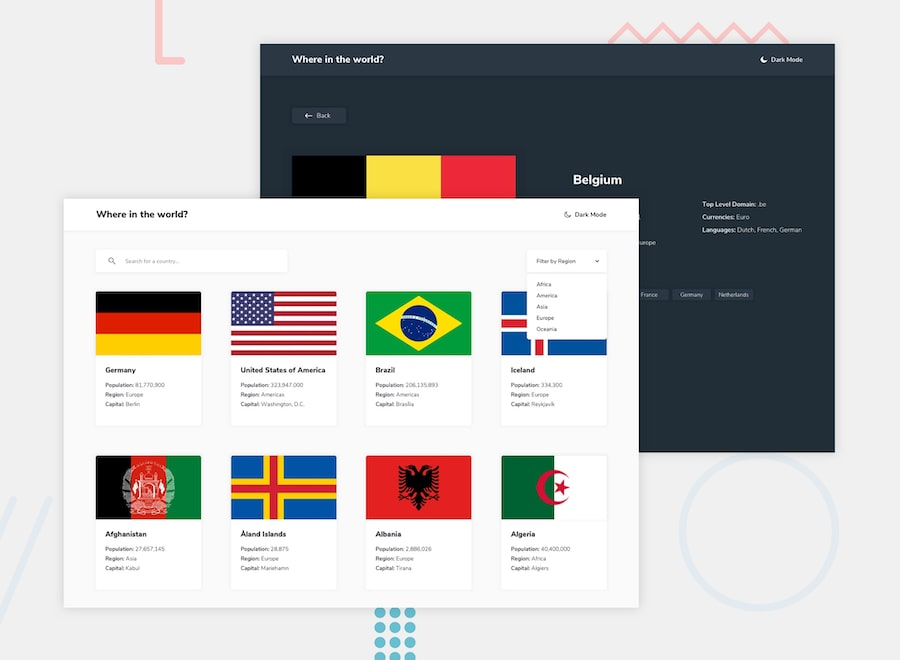

# REST Countries

An interactive countries explorer built for the [Frontend Mentor "REST Countries API with color theme switcher"](https://www.frontendmentor.io/challenges/rest-countries-api-with-color-theme-switcher-5cacc469fb0fd081b8b8fa00) challenge.

Browse every country, search, filter and sort the list, switch between light and dark themes, and read country details with clickable border neighbours — all available in **7 languages**.



## Features

- Search by country name or language
- Filter by UN membership, region, sub-region and time zone
- Sort by name or population (ascending / descending)
- Country detail page with border-country navigation and a Google Maps link
- Light / dark theme switcher
- Internationalization (EN, ES, FR, IT, PT, RU, SR) with language in the URL path
- Search/sort/filter/theme state persisted across reloads
- Pagination and scroll-reveal animations

## Tech stack

- **React 19** + **Vite 6**
- **React Router** for routing (`/:language/...`)
- **i18next** / **react-i18next** for translations
- **Tailwind CSS** for styling
- **AOS** for scroll animations, **react-icons** for icons

## Getting started

```bash
npm install      # install dependencies
npm run dev      # start the dev server (http://localhost:5173)
npm run build    # production build into dist/
npm run preview  # preview the production build
npm run lint     # run ESLint
npm run test     # run the Vitest test suite
```

## Project structure

```text
public/
  data.json        # country dataset
  i18n/*.json      # translations, one file per language
src/
  components/      # UI components (cards, list, filters, header, ...)
  hooks/           # data + UI logic hooks (useCountryData, useFilterLogic, ...)
  pages/           # route-level pages (HomePage, CountryPage, PageNotFound)
  utils/           # shared helpers (fetchCountries, countryUtils)
  styles/          # shared Tailwind class presets
```

## Data

Country data is served statically from `public/data.json` and loaded once through
the cached `fetchCountries()` helper in [`src/utils/fetchCountries.js`](src/utils/fetchCountries.js).
